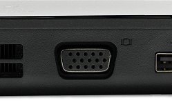

# 基本使用
## 设备开启
1. 按下投影仪遥控器的开机键，打开投影仪和投影幕布。
2. 将VGA接头插到笔记本相应接口，插紧。
3. 如投影幕布上没有显示图像，按笔记本键盘上的fn+f8（各品牌电脑功能键位置不同，按下fn和标识为LCD/CRT或显示器图标的对应键进行切换即可）。

## 设备关闭
1. 按下遥控器的关闭按钮，关闭投影仪和投影幕布。
2. 拔掉笔记本和投影仪接口连线。

**重要提示**
1. 连接投影仪前，请关闭笔记本电脑电源，否则二者接口可能被烧坏！
2. 如果笔记本显示驱动程序安装不完整，则无法使用功能键。
3. 如果笔记本没有VGA接口，需要使用Type-C转VGA转接器转接。
   

