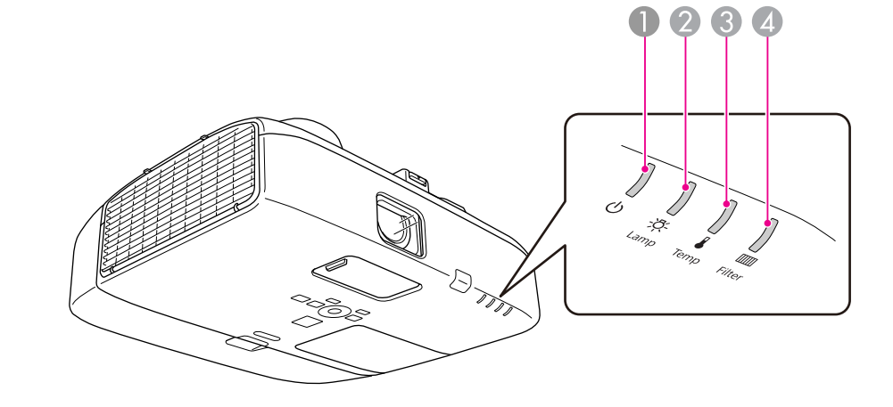

# 读懂指示灯
>本投影仪带有以下四种指示灯，教师可根据指示灯判断投影仪的工作状态。

<table>
   <tr><td><b>指示灯</b></td><td></td><td><b>指示状态</b></td></tr>
   <tr><td>①电源指示灯</td><td></td><td></td></tr>
   <tr><td>黄灯亮</td><td></td><td>待机模式 在此模式下按【I/O】按钮时，投影开始。</td></tr>
   <tr><td>黄灯闪烁</td><td></td><td>正在准备网络监视或正在冷却 该指示灯闪烁期间，所有按钮将被禁用。</td></tr>
   <tr><td>绿灯闪烁</td><td></td><td>正在暖机 暖机时间约为 30 秒。暖机完毕后，指示灯会停止闪烁。 【I/O】按钮在暖机过程中不起作用。</td></tr>
   <tr><td>绿灯亮</td><td></td><td>正在投影</td></tr>
   <tr><td>②灯泡指示灯</td><td></td><td>指示投影灯泡状态</td></tr>
   <tr><td>③温度指示灯</td><td></td><td>指示内部温度状态</td></tr>
   <tr><td>④过滤网指示灯</td><td></td><td>指示空气过滤网状态</td></tr>
   <tr><td></td></tr>
   <tr><td></td></tr>
</table>